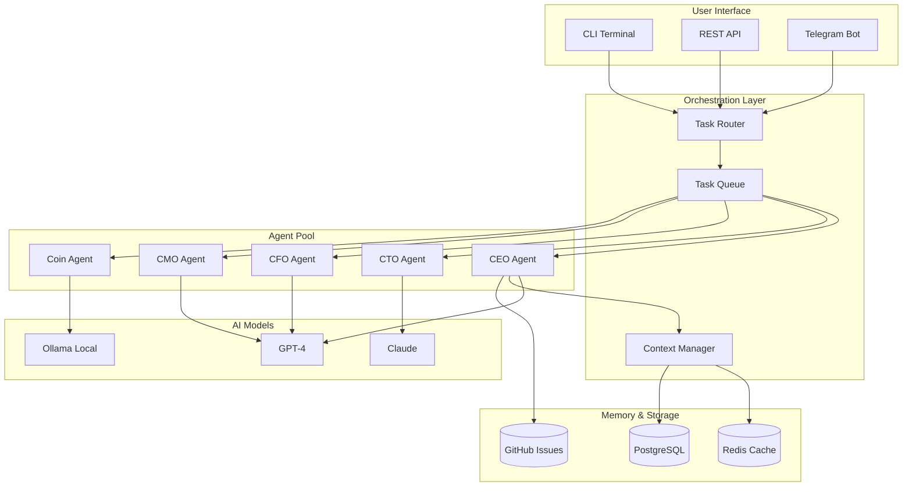

# ThePoet 🧠✨
> Multi-Agent AI Orchestration System for Autonomous Business Logic

[](https://opensource.org/licenses/MIT)
[](https://www.typescriptlang.org/)
[](https://nodejs.org/)
[](https://openai.com/)
[](https://anthropic.com/)

**ThePoet** is a production-ready multi-agent orchestration system that coordinates specialized AI agents to execute complex business workflows autonomously. Built for micro1.ai high-value AI research and agentic workflow roles.

## Overview

ThePoet orchestrates a network of specialized AI agents (CEO, CTO, CFO, CMO, etc.) that collaborate to analyze, plan, and execute tasks. Each agent has distinct expertise, personality, and decision-making capabilities.

### Key Features

- 🤖 **Multi-Agent Architecture** - CEO, CTO, CFO, CMO, Admin agents with specialized roles
- 🔄 **Dynamic Task Routing** - Intelligent assignment based on agent expertise
- 💬 **Context-Aware Communication** - Agents share context and collaborate
- ⚡ **Async Execution** - Parallel agent processing for efficiency
- 🎯 **Goal-Oriented** - Agents work toward defined business outcomes
- 📝 **Structured Output** - JSON-formatted decisions and actions

### Agent Ecosystem

| Agent | Role | Department | Expertise |
|-------|------|------------|-----------|
| **Luke CEO** | Executive Oversight | Executive | Strategy, vision, final decisions |
| **Ovo CTO** | Technical Architecture | Technical | Engineering, system design, tech stack |
| **Max CFO** | Financial Analysis | Finance | Budget, runway, financial modeling |
| **Jabs CFF** | Creative Finance | Finance | Fundraising, investor relations |
| **Ned CMO** | Marketing & Growth | Sales | Brand, community, PR |
| **Arts BLO** | Legal & Comms | Business | Compliance, contracts, IP |
| **Ada Admin** | Operations | Productivity | Scheduling, documentation, coordination |
| **Coin** | Web3 & Crypto | Technical | Blockchain, tokenomics, DeFi |

### Tech Stack

- **Runtime:** Node.js 20 + TypeScript 5.0
- **AI Models:** OpenAI GPT-4, Anthropic Claude, Ollama (local)
- **Orchestration:** Custom agent framework with task queue
- **Communication:** Internal message bus with context preservation
- **Memory:** Short-term (Redis) + Long-term (PostgreSQL)
- **Interface:** CLI + REST API + Telegram Bot

---

## Architecture



### System Components

1. **Task Router** - Analyzes incoming tasks and assigns to appropriate agents
2. **Agent Pool** - Specialized AI agents with distinct personas
3. **Context Manager** - Maintains conversation history and shared state
4. **Model Gateway** - Routes to appropriate LLM based on task complexity
5. **GitHub Integration** - Creates issues, tracks progress, manages projects

---

## Installation

### Prerequisites

- Node.js 20+
- npm or yarn
- PostgreSQL 15+ (optional, for persistent memory)
- Redis (optional, for caching)
- OpenAI API key
- Anthropic API key (optional)
- Telegram Bot Token (optional)

### Quick Start

```bash
# Clone the repository
git clone https://github.com/tricodenetwork/ThePoet.git
cd ThePoet

# Install dependencies
npm install

# Set up environment variables
cp .env.example .env

# Edit .env with your configuration
# OPENAI_API_KEY=sk-...
# ANTHROPIC_API_KEY=sk-...
# TELEGRAM_BOT_TOKEN=...
# DATABASE_URL=postgresql://...

# Initialize the system
npm run setup

# Start the orchestration server
npm run dev
```

### Environment Variables

| Variable | Description | Required |
|----------|-------------|----------|
| `OPENAI_API_KEY` | OpenAI API key for GPT-4 | Yes |
| `ANTHROPIC_API_KEY` | Claude API key | No |
| `OLLAMA_URL` | Local Ollama instance URL | No |
| `TELEGRAM_BOT_TOKEN` | Telegram Bot API token | No |
| `DATABASE_URL` | PostgreSQL connection string | No |
| `REDIS_URL` | Redis connection string | No |
| `GITHUB_TOKEN` | GitHub personal access token | No |

---

## Usage

### CLI Mode

```bash
# Start interactive session
npm run cli

# ThePoet>
```

### Task Routing Example

```typescript
import { ThePoet } from './core/ThePoet';

const poet = new ThePoet();

// Submit a task - automatically routed to appropriate agent
const result = await poet.execute({
  task: "Analyze our Q4 financial projections and suggest cost optimizations",
  context: {
    company: "TRICODE PRO Limited",
    industry: "AI/Blockchain",
    currentBurnRate: 15000
  }
});

console.log(result);
// Output: { agent: "Max CFO", analysis: "...", recommendations: [...] }
```

### Direct Agent Invocation

```typescript
import { OvoCTO } from './agents/OvoCTO';

const cto = new OvoCTO({
  model: 'claude-3-opus',
  temperature: 0.7
});

const architecture = await cto.designSystem({
  requirements: [
    "Handle 10k concurrent users",
    "Sub-100ms response time",
    "Multi-region deployment"
  ],
  constraints: {
    budget: 5000,
    timeline: "3 months"
  }
});

console.log(architecture.blueprint);
```

### Multi-Agent Collaboration

```typescript
// Complex task requiring multiple agents
const campaign = await poet.orchestrate({
  objective: "Launch new product line",
  agents: ['Ned CMO', 'Ovo CTO', 'Max CFO'],
  workflow: [
    { agent: 'Ned CMO', task: 'Define go-to-market strategy' },
    { agent: 'Ovo CTO', task: 'Design technical infrastructure', dependsOn: 0 },
    { agent: 'Max CFO', task: 'Allocate budget and ROI projections', dependsOn: [0, 1] }
  ]
});
```

---

## Agent Capabilities

### CEO Agent (Luke)

Strategic decision-making and executive oversight:

```typescript
import { LukeCEO } from './agents/LukeCEO';

const decision = await lukeCEO.evaluate({
  proposal: "Pivot to B2B SaaS model",
  factors: [
    "Current traction: 150 users",
    "Market size: $50B",
    "Competitive landscape: 3 major players"
  ],
  riskTolerance: 'medium'
});
// Returns: { decision: 'proceed', confidence: 0.85, caveats: [...] }
```

### CTO Agent (Ovo)

Technical architecture and engineering decisions:

```typescript
import { OvoCTO } from './agents/OvoCTO';

const techStack = await ovoCTO.recommendStack({
  project: "AI-powered CRM",
  requirements: [
    "Real-time collaboration",
    "Vector search",
    "Multi-tenant"
  ],
  teamSize: 5,
  timeline: "6 months"
});
// Returns: { frontend: "...", backend: "...", database: "..." }
```

### CFO Agent (Max)

Financial modeling and budget optimization:

```typescript
import { MaxCFO } from './agents/MaxCFO';

const projections = await maxCFO.modelFinancials({
  revenue: [10000, 25000, 50000, 100000],
  costs: [15000, 20000, 30000, 45000],
  funding: 500000,
  runwayMonths: 18
});
// Returns: { runway: "14 months", breakEven: "Month 7", recommendations: [...] }
```

---

## Performance

- **Task Routing Latency:** ~50ms
- **Agent Response Time:** 2-5s (GPT-4), 500ms-2s (Claude), 1-10s (Ollama)
- **Concurrent Agents:** 10+ simultaneous
- **Context Preservation:** 100k tokens per conversation
- **Memory Retrieval:** ~20ms (Redis), ~100ms (PostgreSQL)

---

## Testing

```bash
# Run unit tests
npm test

# Run integration tests
npm run test:integration

# Run agent-specific tests
npm run test:agents

# Run with coverage
npm run test:coverage
```

---

## Deployment

### Local Development

```bash
npm run dev
```

### Production (Docker)

```bash
# Build Docker image
docker build -t thepoet .

# Run with Docker Compose
docker-compose up -d
```

### Railway/Render

[](https://railway.app/template)

---

## Contributing

Contributions are welcome! Please read our [Contributing Guide](CONTRIBUTING.md).

### Development Setup

```bash
# Install dev dependencies
npm install

# Run linter
npm run lint

# Run type checker
npm run type-check

# Run tests in watch mode
npm run test:watch
```

---

## License

MIT License - see [LICENSE](LICENSE)

---

## Related Projects

- [LockUP](https://github.com/tricodenetwork/LockUP) - Web3 + AI asset locking
- [BritBye-RAG](https://github.com/tricodenetwork/BritBye-RAG) - RAG pipeline
- [MintJara](https://github.com/tricodenetwork/MintJara) - AI-powered NFT marketplace

---

## Contact

**Luke Okagha** - CEO & Software Architect
- LinkedIn: [linkedin.com/in/lukeokagha](https://linkedin.com/in/lukeokagha)
- Email: info@lukeokagha.com
- Website: [lukeokagha.com](https://lukeokagha.com)

Project Link: [https://github.com/tricodenetwork/ThePoet](https://github.com/tricodenetwork/ThePoet)

---

## Acknowledgments

- OpenAI for GPT-4 API
- Anthropic for Claude API
- Ollama for local LLM inference
- TRICODE PRO Limited for project sponsorship

---

*Built with 🧠 Intelligence, ⚡ Speed, and 🎯 Purpose*
